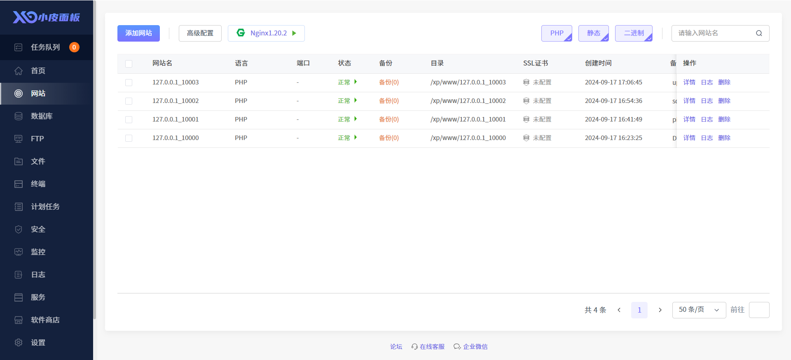
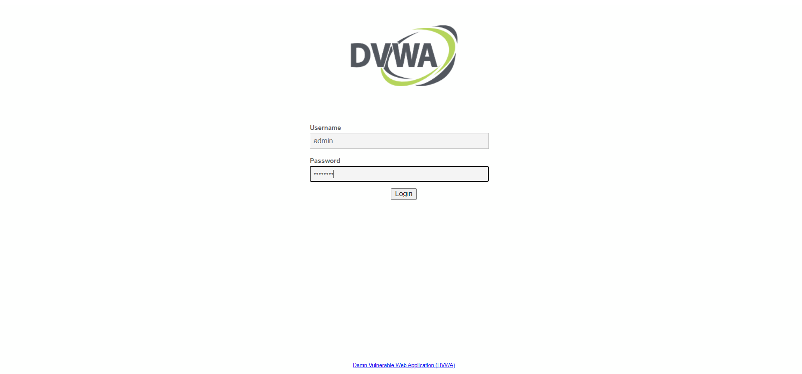

### 环境搭建

> 两个软件选其一即可  

phpstudy(旧)：https://old.xp.cn/  
phpenv：https://www.phpenv.cn/

> 靶场

sqli-labs：https://github.com/Audi-1/sqli-labs  
upload-labs：https://github.com/c0ny1/upload-labs  
DVWA：https://github.com/digininja/DVWA  
pikachu：https://github.com/zhuifengshaonianhanlu/pikachu

### 整合

若懒得自己配置环境，这里也有现成的用。  

> 通过百度网盘分享的文件：靶机.zip  
链接：https://pan.baidu.com/s/1zRUOBbHag47r_beDw7PcnQ?pwd=1145   
提取码：1145 

将靶机文件夹中的ovf导入进vmware-workstation，默认Nat连接，用户密码为nbpt   
`ip a`查看当前ip，我这里是192.168.11.129    

`xp`命令来查看小皮面板，输入1来启动环境  

再次查看面板，输入8查看面板的默认信息  

默认用户名密码都为nbpt，在物理机的浏览器中访问内网面板地址，登陆后即可访问控制面板，在此可以对已安装的四个靶场进行基础的设置    

- DVWA：端口10000，默认用户名admin，密码password
- pikachu：端口10001
- sqli-labs：端口10002
- upload-labs：端口10003

> 由于小皮面板提供的中间件只有Nginx，因此upload-labs中的apache解析漏洞无法复现，有需要的可在熟悉后自行搭建靶场进行复现  

### 示例

若要打DVWA靶场，访问ip:10000，输入用户名密码后即可登陆  

具体的练习过程请在网上自行查找  
